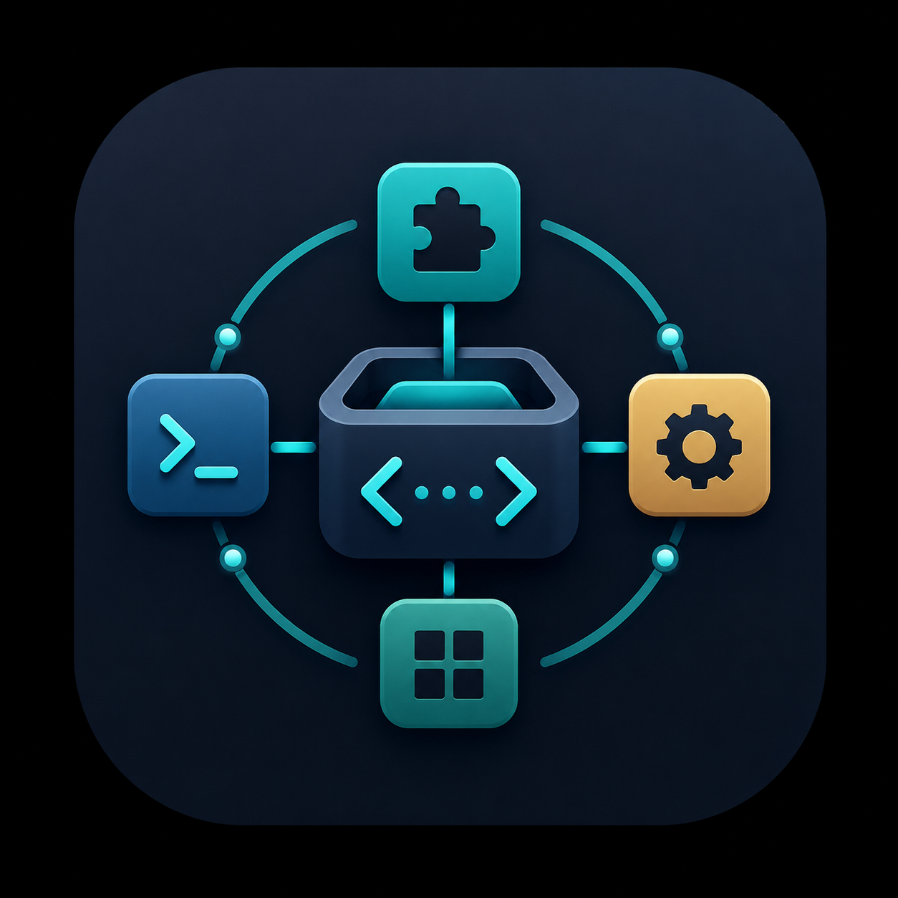

# 🛠️ Claude Code Skill Manager

> A beautiful desktop application to manage all your globally installed [Claude Code](https://claude.ai/code) Skills.
>
> 一款精美的桌面应用，用于管理你全局安装的所有 [Claude Code](https://claude.ai/code) Skills。

<p align="center">
  
</p>

<p align="center">
  <a href="https://github.com/davidleo0228x-afk/claude-code-skill-manager/releases/latest">
    
  </a>
  <a href="https://github.com/davidleo0228x-afk/claude-code-skill-manager/releases/latest">
    
  </a>
  <a href="https://github.com/davidleo0228x-afk/claude-code-skill-manager/releases/latest">
    
  </a>
  <a href="https://github.com/davidleo0228x-afk/claude-code-skill-manager/releases/latest">
    
  </a>
</p>

<p align="center">
  <a href="#english">English</a> · <a href="#中文">中文</a>
</p>

---

## 📥 Download / 下载

<p align="center">
  <a href="https://github.com/davidleo0228x-afk/claude-code-skill-manager/releases/latest/download/Skill-Manager.zip">
    <b>⬇️ 下载 Skill-Manager.zip（2.6 MB）</b>
  </a>
</p>

| Platform / 平台 | 方式 | 说明 |
|---|---|---|
| 🍎 **macOS** | 解压 → `./install.sh` | 原生 SwiftUI 应用，双击桌面图标打开 |
| 🪟 **Windows** | 解压 → 双击 `start-skill-manager.vbs` | 浏览器打开 `http://localhost:3099` |
| 🐧 **Linux** | 解压 → `./install.sh` | 创建 `.desktop` 启动器 |

---

<span id="english"></span>
## ✨ Features

- 📋 **Browse all 27 built-in skills** — view names, descriptions, categories, and trigger keywords at a glance
- 🔍 **Search & filter** — quickly find skills by name or category
- 🏷️ **Trigger keywords on cards** — see how to activate each skill without clicking in
- 🗑️ **Delete skills** — remove unwanted skills with one click
- 🔄 **Auto-sync** — automatically detects and syncs when new skills are installed externally
- 🎨 **Dark theme UI** — clean, modern interface with smooth animations
- 🖥️ **Native macOS app** — runs as a real desktop application (SwiftUI + WKWebView), not a browser tab
- 🌐 **Cross-platform** — macOS native app + Windows/Linux browser fallback

<span id="中文"></span>
## ✨ 功能特性

- 📋 **浏览全部 27 个内置技能** — 一览技能名称、描述、分类和触发关键词
- 🔍 **搜索与筛选** — 按名称或分类快速查找技能
- 🏷️ **卡片展示触发词** — 无需点开即可看到每个技能的激活方式
- 🗑️ **删除技能** — 一键移除不需要的技能
- 🔄 **自动同步** — 外部安装新技能时自动检测并同步
- 🎨 **暗色主题界面** — 简洁现代的设计，流畅动画效果
- 🖥️ **原生 macOS 应用** — 真正的桌面应用（SwiftUI + WKWebView），而非浏览器标签页
- 🌐 **跨平台支持** — macOS 原生应用 + Windows/Linux 浏览器模式

---

## 📸 Screenshots / 截图

<p align="center">
  
</p>

---

## 🚀 Quick Start / 快速开始

### macOS（原生应用）

```bash
# 克隆仓库 / Clone the repo
git clone https://github.com/davidleo0228x-afk/claude-code-skill-manager.git
cd claude-code-skill-manager

# 安装并启动 / Install & launch
chmod +x install.sh
./install.sh
```

This compiles the native SwiftUI app and creates a desktop shortcut. Double-click **Skill Manager** on your desktop to open.
/
脚本会自动编译原生 SwiftUI 应用并在桌面创建快捷方式，双击 **Skill Manager** 即可打开。

### Windows / Linux

```bash
# 克隆并进入 / Clone & enter
git clone https://github.com/davidleo0228x-afk/claude-code-skill-manager.git
cd claude-code-skill-manager

# Linux: 安装并启动
chmod +x install.sh
./install.sh

# Windows: 双击运行 install.bat
```

On Windows and Linux, the app opens in your default browser at `http://localhost:3099`.
/
在 Windows 和 Linux 上，应用会在默认浏览器中打开 `http://localhost:3099`。

### 手动启动 / Manual Start

```bash
# 无需安装依赖 — 纯 Node.js，零依赖！
# No dependencies required — vanilla Node.js!

node server.js

# 浏览器打开 http://localhost:3099
```

---

## 📁 Project Structure / 项目结构

```
skill-manager/
├── server.js              # Node.js HTTP 服务器（零依赖）
├── SkillManager.swift     # macOS 原生应用（SwiftUI + WKWebView）
├── public/
│   ├── index.html         # 单页前端（暗色主题）
│   ├── icon.png           # 应用图标 (1254×1254)
│   ├── favicon-32.png     # 网页图标
│   └── apple-touch-icon.png
├── install.sh             # 跨平台安装脚本
└── .gitignore
```

---

## 🔧 How It Works / 工作原理

1. **Server / 后端** (`server.js`) — 零依赖 Node.js HTTP 服务器：
   - 解析 `~/.agents/skills/` 下的 `SKILL.md` 文件（YAML 前置元数据）
   - 读取 `~/.claude/skills/` 符号链接中的技能元数据
   - 提供 REST API：`GET /api/skills`、`GET /api/skills/:name`、`DELETE /api/skills/:name`
   - 托管 `public/` 静态文件

2. **Frontend / 前端** (`public/index.html`) — 单页应用，包含：
   - CSS Grid 卡片布局 + 悬停动画
   - 实时搜索与分类筛选
   - 详情弹窗展示完整技能信息
   - 30 秒间隔自动检测更新
   - 同步进度条与闪光动画
   - 卡片点击涟漪动效

3. **Native App / 原生应用** (`SkillManager.swift`) — SwiftUI 封装：
   - 在 `WKWebView` 中嵌入 Web 界面
   - 启动时自动运行 Node.js 服务器
   - 作为真正的 macOS 应用运行（Dock 图标、⌘Tab 切换等）
   - 同时支持 Apple Silicon 和 Intel Mac（通用二进制）

---

## 🏗️ Build From Source / 从源码构建

### Prerequisites / 环境要求

- [Node.js](https://nodejs.org/) (v16+)
- **仅 macOS：** Xcode Command Line Tools (`xcode-select --install`)

### Build the Native macOS App / 编译原生 macOS 应用

```bash
# 编译通用二进制（arm64 + x86_64）
# Compile universal binary

swiftc -parse-as-library \
  -target arm64-apple-macos13.0 \
  -o SkillManager_arm64 \
  SkillManager.swift

swiftc -parse-as-library \
  -target x86_64-apple-macos13.0 \
  -o SkillManager_x86_64 \
  SkillManager.swift

lipo -create SkillManager_arm64 SkillManager_x86_64 \
  -output "Skill Manager.app/Contents/MacOS/Skill Manager"

# 清理中间文件 / Clean up
rm SkillManager_arm64 SkillManager_x86_64
```

---

## 📦 Tech Stack / 技术栈

| Layer / 层级 | Technology / 技术 |
|-------------|-------------------|
| Backend / 后端 | Node.js（原生，零依赖） |
| Frontend / 前端 | HTML5、CSS3、Vanilla JavaScript |
| Native App / 原生应用 (macOS) | SwiftUI、WKWebView、AppKit |
| Package / 打包 | Universal Mach-O 通用二进制（arm64 + x86_64） |
| Icons / 图标 | `iconutil` + `sips` → `.icns` |

---

## 🤝 Contributing / 参与贡献

Contributions are welcome! Feel free to open issues or submit PRs.
/
欢迎贡献！欢迎提交 Issue 或 PR。

## 📄 License / 许可证

MIT © [davidleo0228x-afk](https://github.com/davidleo0228x-afk)

---

<p align="center">
  <sub>Built with ❤️ for the Claude Code community · 为 Claude Code 社区用 ❤️ 构建</sub>
</p>
